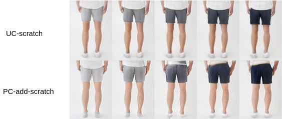
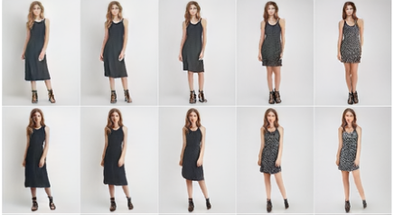
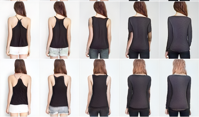
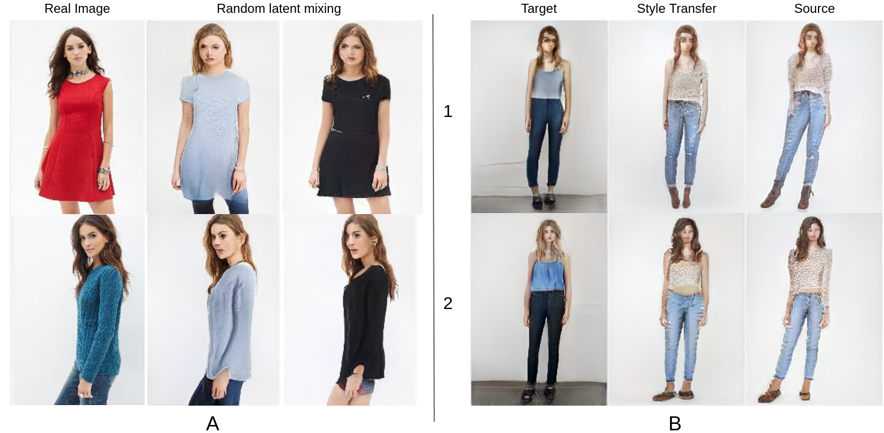

# TryOnGAN-pytorch

WIP : Unofficial pytorch implementation of [TryOnGAN](https://arxiv.org/pdf/2101.02285.pdf)
There are multiple branches :
* `UC` : Unconditioned StyleGAN2-ada, without any changes.
* `PC-add` : Pose conditioned with pose encoders outputs added to style block outputs.
* `PC-concat` : Pose conditioned with pose encoder's outputs concatenated to style block outputs.

## Useful Notebooks :
* Alphapose notebook to create pose keypoints 
* Training Notebook for UC : 
* Training Notebook for PC : 

## Useful links (Drive) :
* [Trained Checkpoints](https://drive.google.com/drive/folders/1_GxdMeMDhGcFlGowQg10dANO1liS0v4Z?usp=sharing)
* [Image Dataset](https://drive.google.com/file/d/1r_Pz2gk1Sp2sjYS7cj9oYUMbLGo9EyZS/view?usp=sharing)
* [Pose keypoints](https://drive.google.com/file/d/1XryABeNxvzsdjEY7j4ed2m4G-we0n0md/view?usp=sharing)

## Some interesting results:
* Interpolation

Color                      |  Length                  | Region
:-------------------------:|:-------------------------:|:-------------------------:
 ||

I inverted two real images into latent codes and interpolated between the two codes. Interestingly the intermediate images are valid garments. Maybe we can extend this technique to generate novel garments composed of multiple components. Note that pose changes for UC models but not with PC. Scratch here means model was trained with random weights without transfer learning.
* Style mixing for UC model
 
A is images generated by mixing latents of a real image with random latent code. B is by mixing two real images. Mixing here means replacing latent codes for lower six style blocks with other latent codes.

## Datasets
Some of these datasets have images only of dress or have multiple people in the same image. Such images need to be discarded or modified.

* [Deep Fashion(48k)](https://drive.google.com/drive/folders/0B7EVK8r0v71pTHhMenkxbE9fTVk?resourcekey=0-vTjoKh5LuocS_K3yxycXIg&usp=sharing)
* [Categorization Dress Pattern (16k)](https://data.world/crowdflower/categorization-dress-patterns)
* [Female Model images(2k)](https://www.kaggle.com/mercymeilya/2243-pictures-of-female-models-from-modelmangemt)
* [Apparel Dataset(16k)](https://www.kaggle.com/kaiska/apparel-dataset)
* [Bridal Dress(622)](https://www.kaggle.com/elhamazizi/bridal-dress)
* [Dress Recognition(7k)](https://www.kaggle.com/guardian222/dress-recognition)
* [Dress Fashion(60k)](https://www.kaggle.com/ssr123456/dressfasion)
* [Dress Class Color(8k)](https://www.kaggle.com/ssr123456/dress-class-color)
* [Trousers(1.4k)](https://www.kaggle.com/ssr123456/dress-trousers)
* [Apparel Images Dataset(11k)](https://www.kaggle.com/trolukovich/apparel-images-dataset)
* [Full-body-mads-dataset(1.2k)](https://www.kaggle.com/tapakah68/segmentation-full-body-mads-dataset)
* [Full-body-tiktok-dancing-dataset(2.6k)](https://www.kaggle.com/tapakah68/segmentation-full-body-tiktok-dancing-dataset)
* [somaset- synthetic humans(100k)](https://www.kaggle.com/vicolab/somaset)
* [Agender, full body image of people in the wild(4.6k)](https://www.kaggle.com/mayank735/agender)
* [Everybody dance now, single person,full body and pose keypoints(83.9k)](https://www.kaggle.com/amoghmisra27/everybody-dance-now1)
* [Everybody dance now(40.3k)](https://www.kaggle.com/lalitmohan4398/everybody-dance-nowsubject-2)
* [Everybody dance now(35.4k](https://www.kaggle.com/lalitmohan4398/everbody-dance-now-subject-3)
* [Yoga Poses(1.5k)](https://www.kaggle.com/niharika41298/yoga-poses-dataset)
* [Yoga Poses - Large(6k)](https://www.kaggle.com/shrutisaxena/yoga-pose-image-classification-dataset)
* [Human 3.6m](http://vision.imar.ro/human3.6m/description.php)

StyleGAN2 code is based on official [StyleGAN2-ada rep](https://github.com/NVlabs/stylegan2-ada-pytorch)

